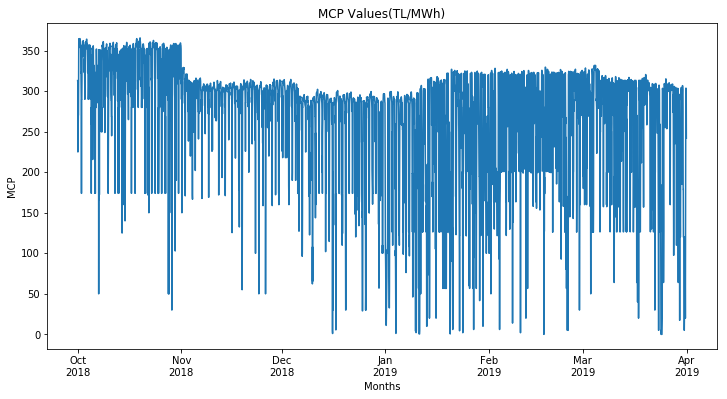
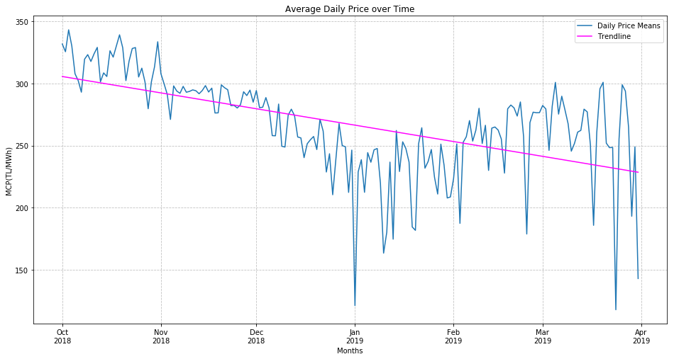
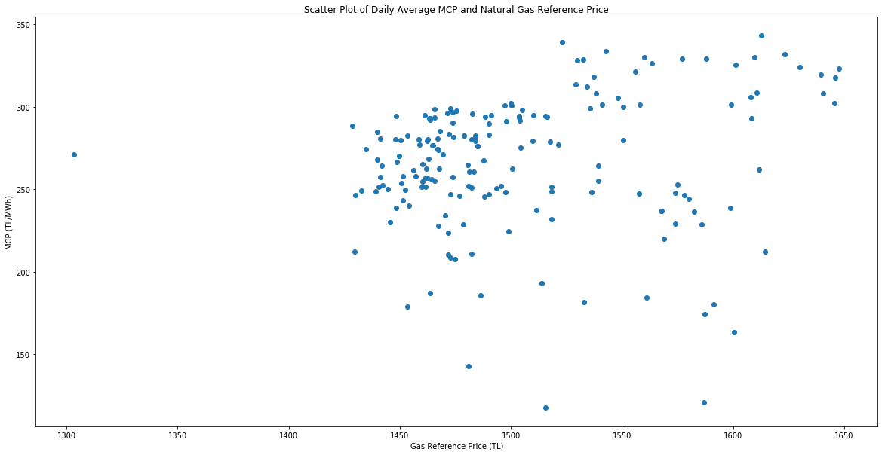
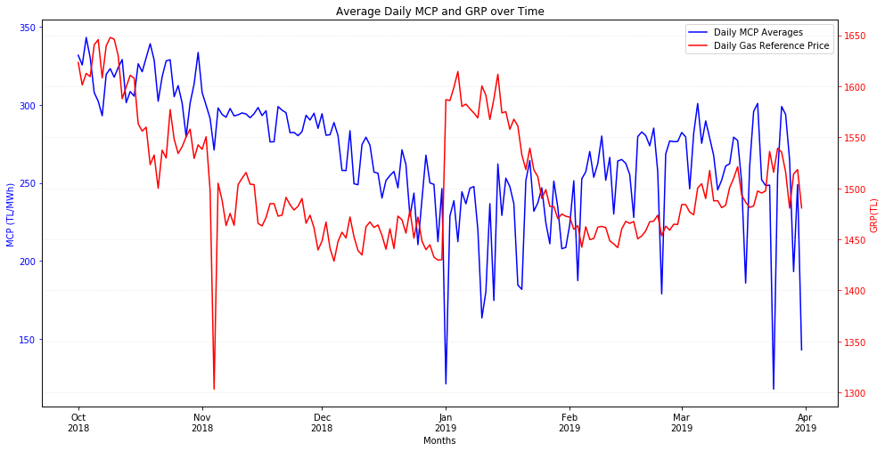
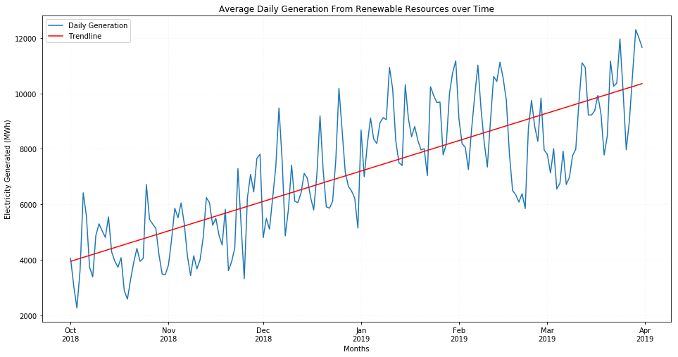
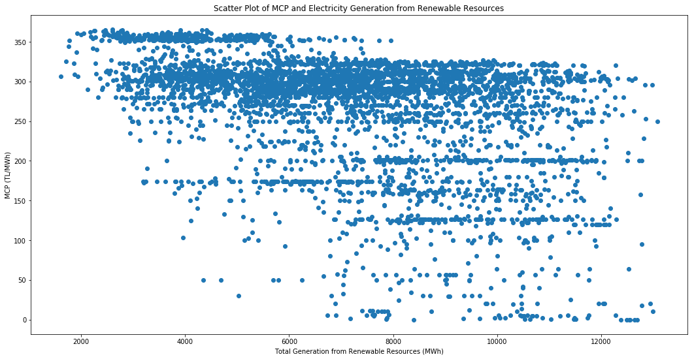

#### 09 May 2019

# Reasons About Fluctuations of The Market Clearing Price in Day-Ahead Market between September-2018 and March-2019

##### Written By: Alkım Can Çelik


## Introduction


In Turkey, there are markets in Energy sector to exchange electricity. Most agreements are bilateral contracts, approximately 68% of all agreements in 2017, 61% in 2018. Since bilateral contracts are made by taking into consideration forecasting supply and demand, when time to deliver electricity has come, there may be inbalance between supply and demand. Therefore, companies which have excess electricity and companies which need electricity can deal with each other. Agreements in day-ahead market are 27% of all agreements in 2017, 36% of all agreements in 2018. There is a significance increasing in using day-ahead market. The importance of day-ahead market cannot be ignored. EPİAŞ(Enerji Piyasaları İşletmeleri A.Ş.) is responsible for deciding Market Clearing Price(MCP), in Turkish "Piyasa Takas Fiyatı", in day-ahead market. In this analysis, my aim is to find reasons for fluctiations in Market Clearing Price in day-ahead market. The data I used belongs to EPİAŞ Transparency Platform.  


#### Some reasons that we check 

- Natural Gas Daily Reference Price
- Generated Electricity in All Renewable Energy Sources


# Contents:

1) **Libraries**

2) **Market Clearing Price Behaviour**

3) **Analyzing Effects of Some External Variables over MCP**
   
    A. Natural Gas Reference Prices

    B. Total Generation from All Renewable Resources
    
4) **Conclusion**


### 1) Libraries


```python
import warnings
warnings.filterwarnings('ignore')
from scipy.stats.stats import pearsonr
import pandas as pd
import numpy as np
import matplotlib.pyplot as plt
import matplotlib.dates as mdates
```

### 2) Market Clearing Price Behaviour

In this section, we analyze behaviour of the market clearing price in day-ahead market between October 2018 and April 2019.


```python
df = pd.read_csv("C:/Users/sena/Desktop/IE Coursebooks/PTF-01102018-01102019.csv",parse_dates=[[0,1]], dayfirst=True)#Data extracted in csv format
print(df.info(),'\n\n')
print(df.head())
```

    <class 'pandas.core.frame.DataFrame'>
    RangeIndex: 4368 entries, 0 to 4367
    Data columns (total 2 columns):
    Date_Hours    4368 non-null datetime64[ns]
    MCP           4368 non-null object
    dtypes: datetime64[ns](1), object(1)
    memory usage: 68.3+ KB
    None 
    
    
               Date_Hours     MCP
    0 2018-10-01 00:00:00  313,09
    1 2018-10-01 01:00:00  313,09
    2 2018-10-01 02:00:00  224,99
    3 2018-10-01 03:00:00  270,68
    4 2018-10-01 04:00:00  253,44
    

Firstly, we have to set an index. The most appropriate choice is datetime column.  


```python
df = df.set_index(['Date_Hours'])
```

The data type of MCP is not recognized. Therefore, we remove the commas and convert to integer value.


```python
df['MCP'] = df['MCP'].str.replace(',','.')  # Removing the commas
df['MCP'] = df['MCP'].apply(pd.to_numeric) # Converting MCP to numeric value
df.head() # A view of its final form
df.describe() # Statistical review of MCP
```


<div>
<style scoped>
    .dataframe tbody tr th:only-of-type {
        vertical-align: middle;
    }

    .dataframe tbody tr th {
        vertical-align: top;
    }

    .dataframe thead th {
        text-align: right;
    }
</style>
<table border="1" class="dataframe">
  <thead>
    <tr style="text-align: right;">
      <th></th>
      <th>MCP</th>
    </tr>
  </thead>
  <tbody>
    <tr>
      <th>count</th>
      <td>4368.000000</td>
    </tr>
    <tr>
      <th>mean</th>
      <td>267.119991</td>
    </tr>
    <tr>
      <th>std</th>
      <td>73.297412</td>
    </tr>
    <tr>
      <th>min</th>
      <td>0.000000</td>
    </tr>
    <tr>
      <th>25%</th>
      <td>250.000000</td>
    </tr>
    <tr>
      <th>50%</th>
      <td>291.905000</td>
    </tr>
    <tr>
      <th>75%</th>
      <td>310.090000</td>
    </tr>
    <tr>
      <th>max</th>
      <td>365.780000</td>
    </tr>
  </tbody>
</table>
</div>


```python
fig, ax = plt.subplots(figsize=(12, 6))
ax.xaxis.set_major_locator(mdates.MonthLocator(interval=1))
ax.xaxis.set_major_formatter(mdates.DateFormatter('%b\n%Y'))
ax.xaxis.set_minor_locator(mdates.MonthLocator())
ax.plot(df['MCP'])
ax.set_title("MCP Values(TL/MWh)")
ax.set_xlabel('Months')
ax.set_ylabel('MCP')

```


    Text(0,0.5,'MCP')





As we see, there are very significant fluctuations in MCP values. The reason is that there are time intervals which electricity is used very less, like at 5 a.m. In these intervals, producers having excess electricity match very few buyers in day-ahead market, so the market keeps the MCP very low, even 0 TL at some points. 

    
The graph is plotted in hour frame. In general, it cannot show the behaviour of MCP in 6 months. We have to resample the hourly prices in daily frame.


```python
df_daily = df['MCP'].resample('D', label = 'left').mean()
df_daily = df_daily.to_frame()
```

Now, we ready to plot the behaviour of average daily MCP.


```python
x = np.array(range(len(df_daily["MCP"])))
z = np.polyfit(x,df_daily["MCP"],deg=1)  # Calculating the coeffecients of the trendline
p = np.poly1d(z)
fig, ax = plt.subplots(figsize=(16,8))
ax.plot(df_daily["MCP"], label='Daily Price Means')  # Plotting the monthly averages
ax.plot(df_daily.index, p(x), color='magenta', label='Trendline')  # Plotting the trendline
ax.legend()
ax.xaxis.set_major_locator(mdates.MonthLocator(interval=1))
ax.xaxis.set_major_formatter(mdates.DateFormatter('%b\n%Y'))
ax.xaxis.set_minor_locator(mdates.MonthLocator())
ax.set_title("Average Daily Price over Time")
ax.set_xlabel('Months')
ax.set_ylabel('MCP(TL/MWh)')
plt.grid(linestyle='--', alpha=0.8)
print('The slope of the trend line is {:.2f} TL/Day, {:.2f} TL/Month.'.format(z[0],z[0]*30))
```

    The slope of the trend line is -0.43 TL/Day, -12.79 TL/Month.
    





When we look at the graph, we can clearly see that average daily price shows a tendency to decrease between October 2018 and April 2019. 


### 3)Analyzing Effects of Some External Variables over MCP

#### A. Natural Gas Reference Prices

In this section, we analyze the effects of natural gas prices over MCP. The reason behind the test is that natural gas is a very common resource to generate electricity. Most of them are imported, so the price may be a reason for fluctuations of MCP. Natural gas reference price has an abbreviation, which is "GRP". 

We take the data.


```python
gas = pd.read_csv("C:/Users/sena/Desktop/IE Coursebooks/Gaz_Referans_Fiyati_(GRF)_2018-10-01_2019-04-23.csv",parse_dates=[0],dayfirst=True,encoding = 'unicode_escape')
```


```python
print(gas.info())
```

    <class 'pandas.core.frame.DataFrame'>
    RangeIndex: 182 entries, 0 to 181
    Data columns (total 2 columns):
    Gaz Günü    182 non-null datetime64[ns]
    GRP         182 non-null object
    dtypes: datetime64[ns](1), object(1)
    memory usage: 2.9+ KB
    None
    

We decide an index for *gas*


```python
gas = gas.set_index(['Gaz Günü'])
gas.describe()
```


<div>
<style scoped>
    .dataframe tbody tr th:only-of-type {
        vertical-align: middle;
    }

    .dataframe tbody tr th {
        vertical-align: top;
    }

    .dataframe thead th {
        text-align: right;
    }
</style>
<table border="1" class="dataframe">
  <thead>
    <tr style="text-align: right;">
      <th></th>
      <th>GRP</th>
    </tr>
  </thead>
  <tbody>
    <tr>
      <th>count</th>
      <td>182</td>
    </tr>
    <tr>
      <th>unique</th>
      <td>179</td>
    </tr>
    <tr>
      <th>top</th>
      <td>1.485,00</td>
    </tr>
    <tr>
      <th>freq</th>
      <td>2</td>
    </tr>
  </tbody>
</table>
</div>


Since data type of "GRP" is unknown, we have to transform into float.


```python
gas["GRP"] = gas['GRP'].str.replace('.','')
gas["GRP"] = gas['GRP'].str.replace(',','.')
gas["GRP"] = list(map(float,gas["GRP"]))
gas.info()
```

    <class 'pandas.core.frame.DataFrame'>
    DatetimeIndex: 182 entries, 2018-10-01 to 2019-03-31
    Data columns (total 1 columns):
    GRP    182 non-null float64
    dtypes: float64(1)
    memory usage: 2.8 KB
    

If we check the data;


```python
len(gas) - gas['GRP'].count()#To find rows having NaN values
```


    0


There are rows which have NaN values. We have to remove these rows to plot the data correctly.


```python
gas = gas[np.isfinite(gas['GRP'])]
```

Now, we are ready to compare the data. We merge *df* and *gas*

*pd.concat* function requires that the indices be unique. To remove rows with duplicate indices;


```python
gas = gas.loc[~gas.index.duplicated(keep='first')]
df_daily = df_daily.loc[~df_daily.index.duplicated(keep='first')]
df1 = pd.concat([gas,df_daily['MCP']], axis=1)
fig, ax = plt.subplots(figsize=(20, 10))
ax.set_title("Scatter Plot of Daily Average MCP and Natural Gas Reference Price")
ax.set_xlabel('Gas Reference Price (TL)')
ax.set_ylabel('MCP (TL/MWh)')
ax.scatter(df1['GRP'], df1['MCP'])
corr3 = pearsonr(df1['GRP'], df1['MCP'])
print("The correlation coeffecient between Natural Gas Reference Price and MCP is {0:.2f} and the p-value is {1:.2e}".format(corr3[0],corr3[1]))
```

    The correlation coeffecient between Natural Gas Reference Price and MCP is 0.16 and the p-value is 3.05e-02
    





If we evaluate the correlation coefficient between MCP and Gas Reference Price(GRP), we can say that there is no strong correlation between them, because we cannot expect a quick response in MCP to rapid changing GRP. MCP is related to the amount of electricity in the day-ahead market. GRP may affect the daily average MCP in the upcoming days. Also, GRP is used in Natural Gas Continuous Trading Platform fundamentally.Daily average MCP can be affected indirect way.


```python
fig, ax1 = plt.subplots(figsize=(16,8))
ins1 = ax1.plot(df_daily["MCP"], color='blue', label='Daily MCP Averages')  # Plotting the monthly averages
ax1.set_xlabel('Months')
ax1.set_ylabel('MCP (TL/MWh)', color='blue')
ax1.tick_params('y', colors='blue')
ax2 = ax1.twinx()
ins2 = ax2.plot(gas["GRP"], color='r', label='Daily Gas Reference Price')  # Plotting the trendline
ax2.set_ylabel('GRP(TL)', color='r')
ax2.tick_params('y', colors='r')
ax1.xaxis.set_major_locator(mdates.MonthLocator(interval=1))
ax1.xaxis.set_major_formatter(mdates.DateFormatter('%b\n%Y'))
ax1.xaxis.set_minor_locator(mdates.MonthLocator())
ax1.set_title("Average Daily MCP and GRP over Time")
plt.grid(linestyle='--', alpha=0.2)
ins = ins1+ins2
labs = [l.get_label() for l in ins]
ax1.legend(ins, labs, loc=0)
```


    <matplotlib.legend.Legend at 0x1de96364860>





Again, we can realize that there is a weak correlation between daily MCP average and GRP. However, when GRP increases or decreases, daily MCP average is affected after few days, same changing with GRP.     

#### B. Total Generation from All Renewable Resources 

It is hard to forecast how much electricity can be generated in that time. Renewable resources should be a good example for our experiment since they instantaneously vary hour-by-hour.  

Like Natural Gas Reference Price section, we take the data and do manipulations to plot these values.


```python
total_uretim = pd.read_csv("C:/Users/sena/Desktop/IE Coursebooks/yekdemLisansliUretimMiktari-01102018-01042019.csv",parse_dates=[[0,1]], dayfirst=True)
print(total_uretim.head(),'\n\n')
print(total_uretim.info())
```

               Tarih_Saat    Toplam
    0 2018-10-01 00:00:00  3.743,74
    1 2018-10-01 01:00:00  3.758,02
    2 2018-10-01 02:00:00  3.682,02
    3 2018-10-01 03:00:00  3.788,95
    4 2018-10-01 04:00:00  3.850,54 
    
    
    <class 'pandas.core.frame.DataFrame'>
    RangeIndex: 4368 entries, 0 to 4367
    Data columns (total 2 columns):
    Tarih_Saat    4368 non-null datetime64[ns]
    Toplam        4368 non-null object
    dtypes: datetime64[ns](1), object(1)
    memory usage: 68.3+ KB
    None
    


```python
total_uretim = total_uretim.set_index(['Tarih_Saat'])#Setting index
```


```python
total_uretim["Toplam"] = total_uretim['Toplam'].str.replace('.','')
total_uretim["Toplam"] = total_uretim['Toplam'].str.replace(',','.')
total_uretim["Toplam"] = list(map(float,total_uretim["Toplam"]))#Converting float
total_uretim.describe()
```


<div>
<style scoped>
    .dataframe tbody tr th:only-of-type {
        vertical-align: middle;
    }

    .dataframe tbody tr th {
        vertical-align: top;
    }

    .dataframe thead th {
        text-align: right;
    }
</style>
<table border="1" class="dataframe">
  <thead>
    <tr style="text-align: right;">
      <th></th>
      <th>Toplam</th>
    </tr>
  </thead>
  <tbody>
    <tr>
      <th>count</th>
      <td>4368.000000</td>
    </tr>
    <tr>
      <th>mean</th>
      <td>7148.743903</td>
    </tr>
    <tr>
      <th>std</th>
      <td>2420.877202</td>
    </tr>
    <tr>
      <th>min</th>
      <td>1606.640000</td>
    </tr>
    <tr>
      <th>25%</th>
      <td>5323.812500</td>
    </tr>
    <tr>
      <th>50%</th>
      <td>7138.370000</td>
    </tr>
    <tr>
      <th>75%</th>
      <td>8973.940000</td>
    </tr>
    <tr>
      <th>max</th>
      <td>13083.020000</td>
    </tr>
  </tbody>
</table>
</div>


To look at the bigger picture, let's analyze behaviour of daily total generation from renewable resources:


```python
total_uretim_daily = total_uretim["Toplam"].resample('D', label = 'left').mean()
total_uretim_daily = total_uretim_daily.to_frame()
```


```python
x = np.array(range(len(total_uretim_daily["Toplam"])))
z = np.polyfit(x,total_uretim_daily["Toplam"],deg=1)  # Calculating the coeffecients of the trendline
p = np.poly1d(z)
fig, ax = plt.subplots(figsize=(16,8))
ax.plot(total_uretim_daily["Toplam"], label='Daily Generation')  # Plotting the monthly averages
ax.plot(total_uretim_daily.index, p(x), color='r', label='Trendline')  # Plotting the trendline
ax.legend()
ax.xaxis.set_major_locator(mdates.MonthLocator(interval=1))
ax.xaxis.set_major_formatter(mdates.DateFormatter('%b\n%Y'))
ax.xaxis.set_minor_locator(mdates.MonthLocator())
ax.set_title("Average Daily Generation From Renewable Resources over Time")
ax.set_xlabel('Months')
ax.set_ylabel('Electricity Generated (MWh)')
plt.grid(linestyle='--', alpha=0.1)
print('The slope of the trend line is {:.2f} MWh/day and {:.2f} MWh/month.'.format(z[0],z[0]*30))
```

    The slope of the trend line is 35.39 MWh/day and 1061.74 MWh/month.
    





The graph above shows that the average daily electricity generated in renewable resources increases in every month. One of the reasons is that the amount of rainfall and snowfall significantly increases in these months. Hence, we think daily average MCP should decrease unless there is another reason to affect in reverse direction.


```python
df3 = pd.concat([total_uretim,df["MCP"]], axis=1)
fig, ax = plt.subplots(figsize=(18, 9))
ax.set_title("Scatter Plot of MCP and Electricity Generation from Renewable Resources")
ax.set_xlabel('Total Generation from Renewable Resources (MWh)')
ax.set_ylabel('MCP (TL/MWh)')
ax.scatter(df3['Toplam'], df3['MCP'])
corr3 = pearsonr(df3['Toplam'], df3['MCP'])
print("The correlation coeffecient between total production from renewable resources and hourly market clearing price is {0:.2f} and the p-value is {1:.2e}".format(corr3[0],corr3[1]))
```

    The correlation coeffecient between total production from renewable resources and hourly market clearing price is -0.42 and the p-value is 5.85e-187
    





As we expect, there is a negative correlation between electricity generated from renewable resources and hourly Market Clearing Price. 

As a result, increasing the amount of electricity generated from the renewable resources supports the downfall of the hourly Market Clearing Price. Our claim was true. In day-ahead market, we can observe that quick fluctuations in hourly generation from renewable resources have a quick effect over hourly MCP.

### 4) Conclusion

When we look at the numerical values and graphs, 
- Hourly Market Clearing Price in day-ahead market have shown very significant fluctuations between October 2018 and April 2019.
- MCP in day-ahead market tends to decrease in Fall and Winter.
- Daily Gas Reference Price and daily average MCP in the same day is nearly irrelevant. However, daily GRP may have an affect over daily average MCP in the upcoming days, like a week. 
- Daily electricity generated from renewable resources tends to increase in Fall and Winter because wind generators and dams work in high capacity in this time interval.
- Hourly MCP has a strong negative correlation with hourly electricity generated from renewable resources.
